# Screen Design

### Home Page and About Page

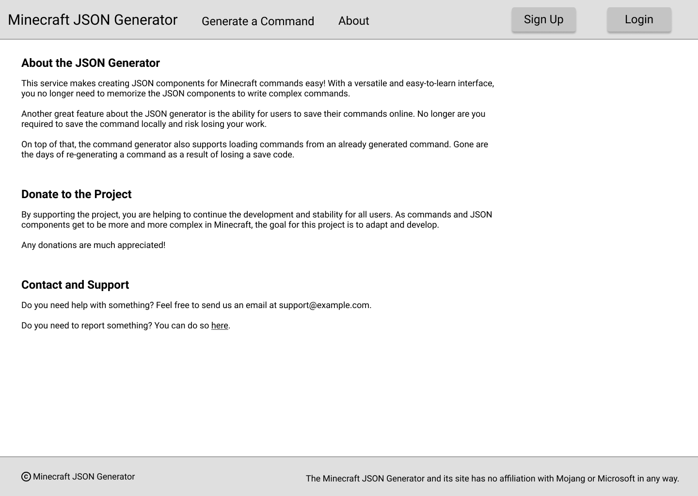

### Generate Command Selection Page

### Generate Tellraw Command Page

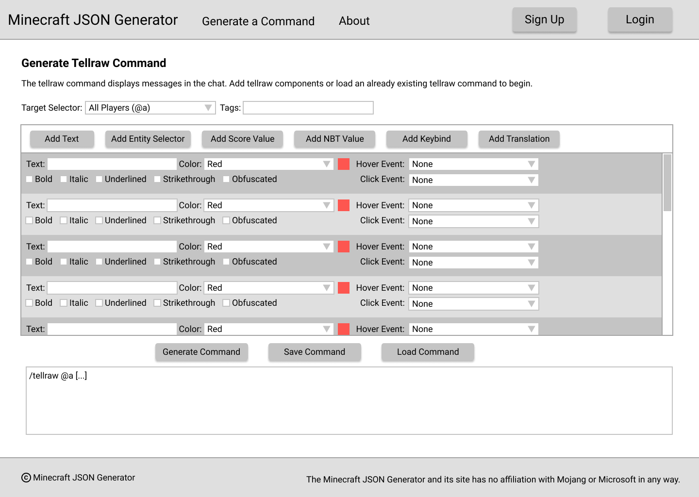

### Generate Title Command Page

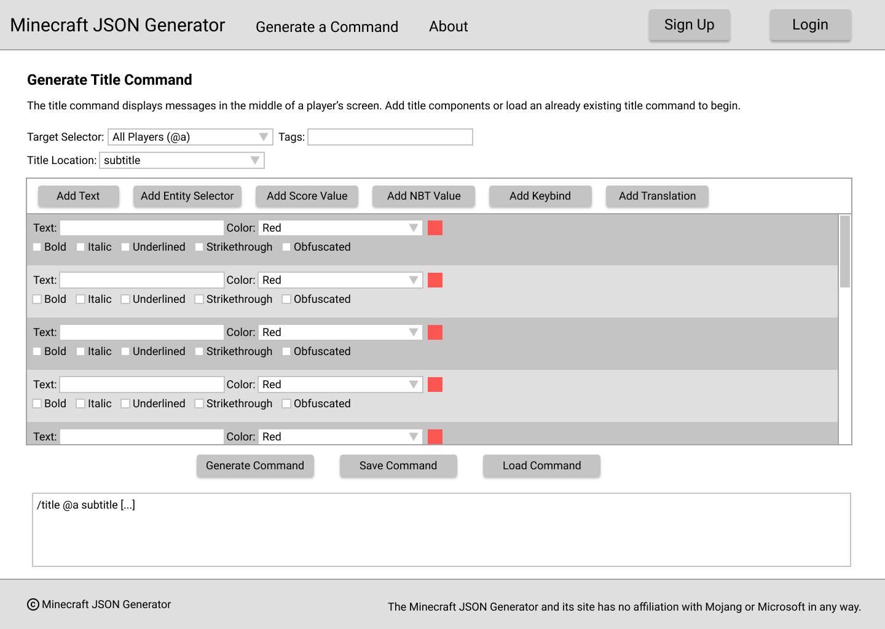

### Generate Written Book Command Page

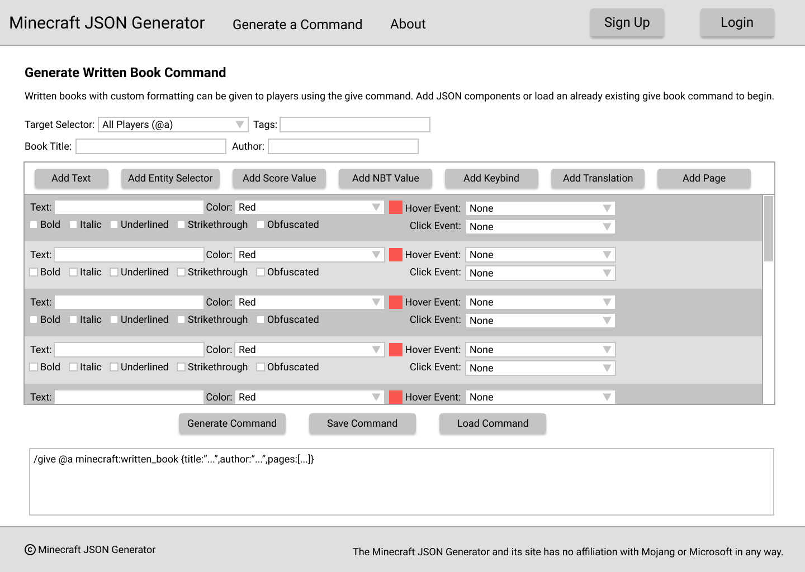

### Generate Sign Command Page

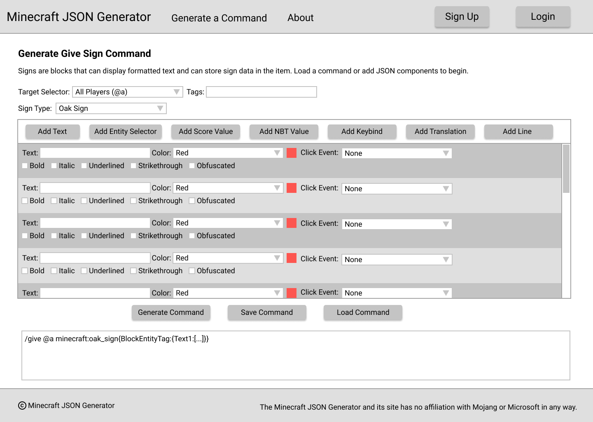

### Generate Named Item Command Page

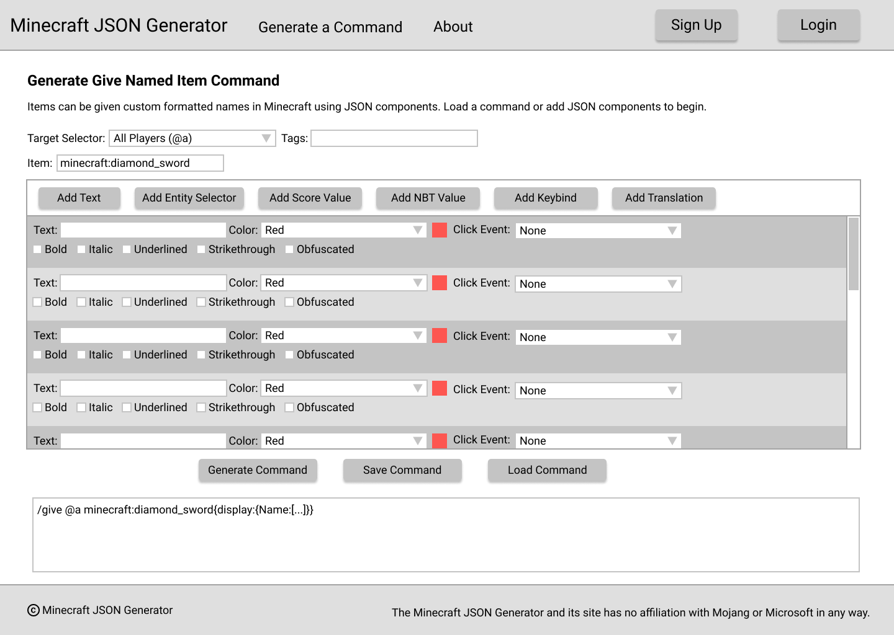

### Sign Up Page

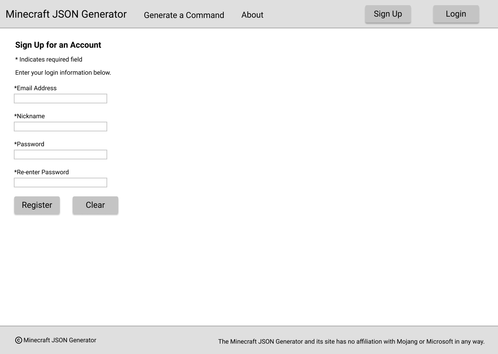

### Login Page

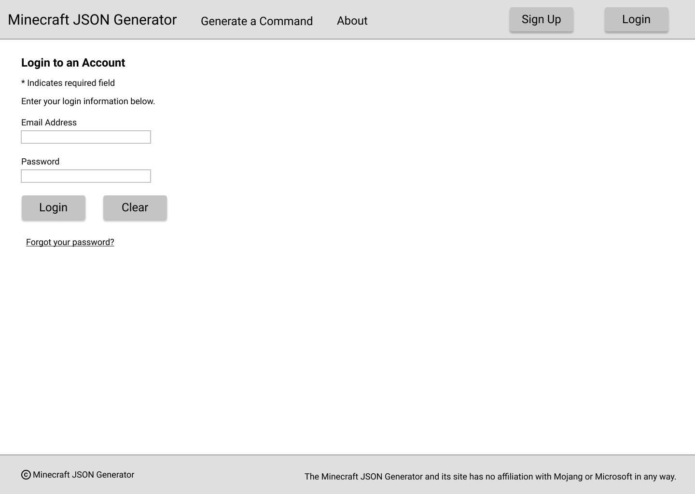

### View User's Saved Commands Page

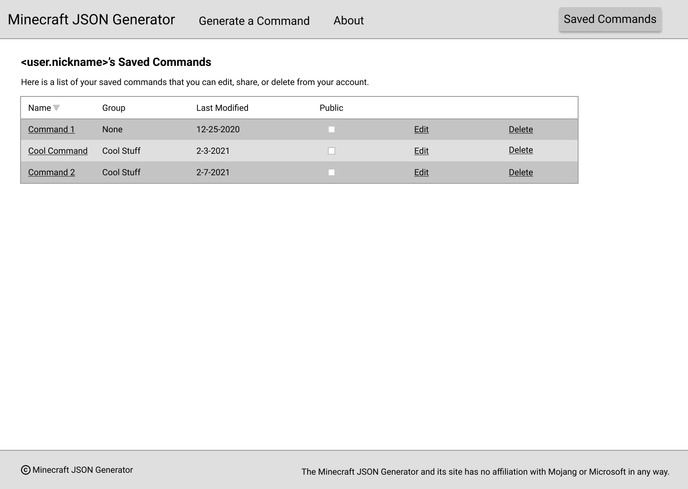

### Confirm Deletion of User Command Page

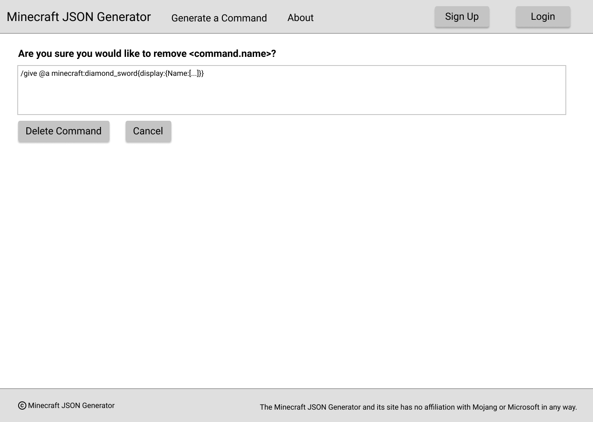

### View Public Command Page

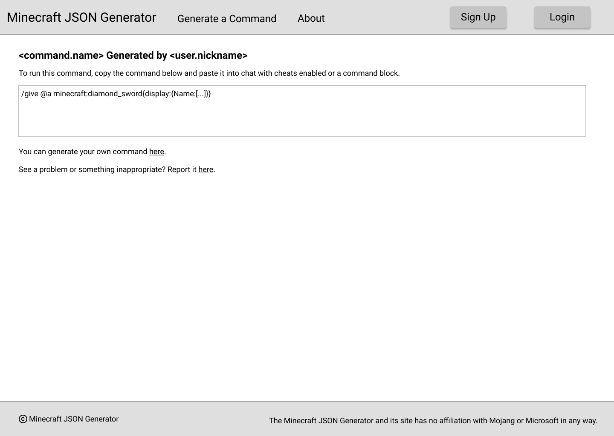

### Report Issue Page

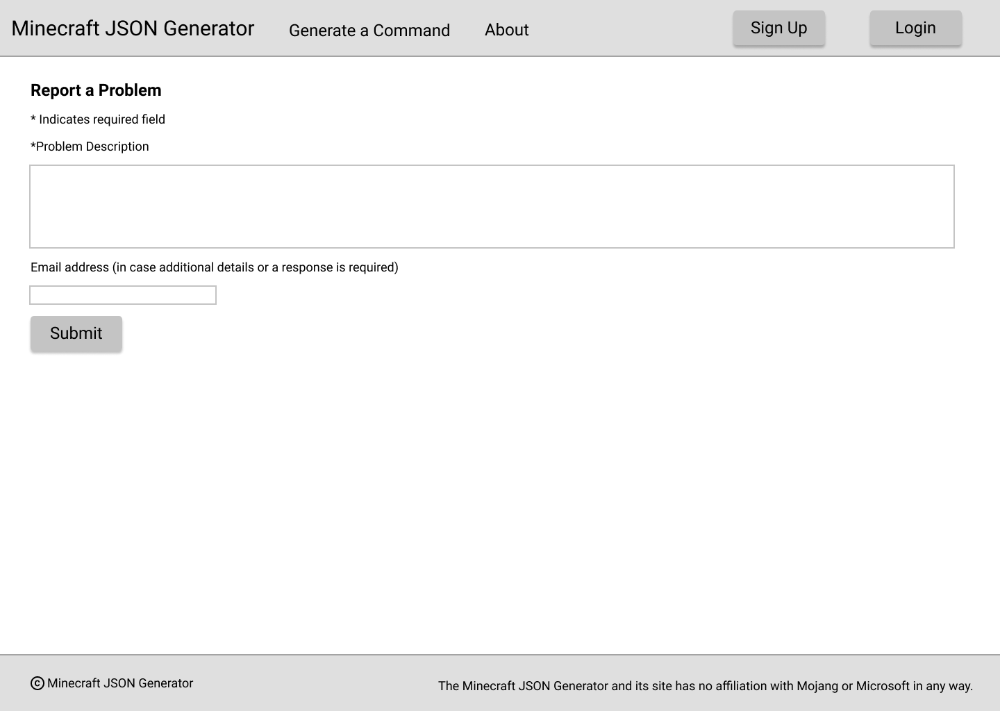

### Load Command Page

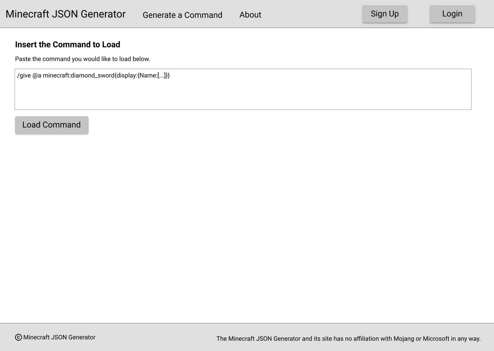

### Save Command Dialog/Prompt

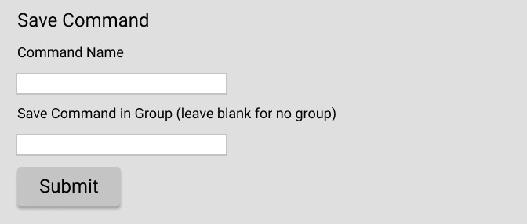
