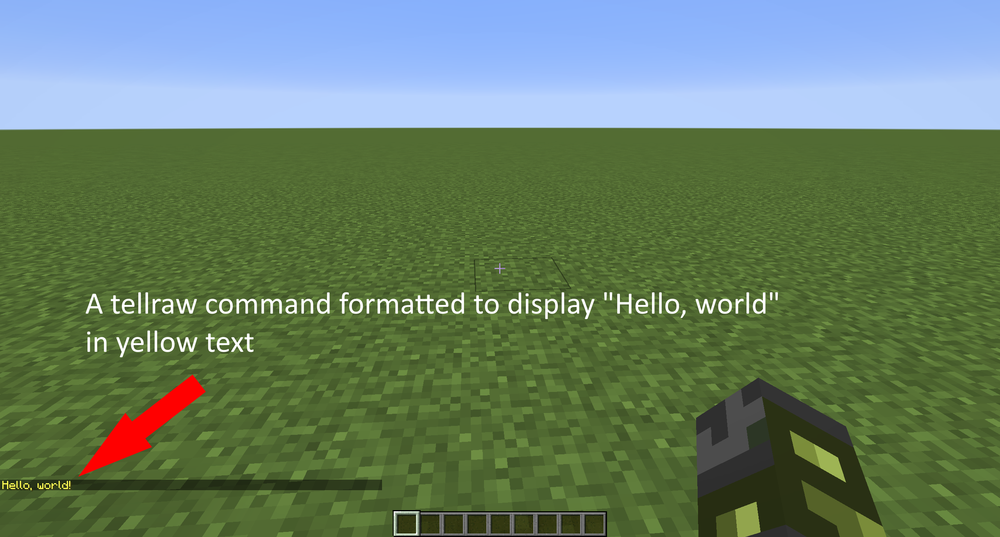

# Minecraft JSON Generator - Indie Project

## Problem Statement

Minecraft is a game about creativity and innovation. As such, it  
offers a wide variety of means to learn and interact with the  
game. One aspect in which players might play the game is through  
the built-in scripting language called commands.

Since its inception, commands have grown substantially in both  
capability and usability. Through commands, players have much  
freedom in modifying the way Minecraft works. As to be expected,  
however, there are aspects of the scripting language that can be  
redundant, hard to modify using the in-game text editor, or even  
confusing for new players.

In Minecraft, a substantial amount of data is stored and  
referenced using **J**ava**S**cript **O**bject **N**otation, or  
JSON. The scripting language also takes advantage of JSON  
components to display and format text throughout a variety of  
sources, such as chat messages, books, signs, etc.

The problem is that the specific JSON components can be hard to  
remember and even more difficult to write using the in-game text  
editor UI, which only shows a small section of one line of code.  
For these reasons, I would like to build a general purpose  
Minecraft command generator. Specifically, it will emphasize on  
the commands that utilize JSON components for the formatting of  
text in the game.

As a reference, below is a screenshot from Minecraft where a
tellraw command is run. These commands utilize JSON elements in
order to format messages in the in-game multiplayer chat.

## Project Technologies (WIP, more will be added during development)

* Project Design
    * Figma for screen design / wireframes
* Security/Authentication
    * Tomcat's JDBC Realm Authentication
* Database
    * MySQL 8.0.22
* ORM Framework
    * Hibernate 5
* Build Tool & Dependency Management
    * Gradle
* CSS
    * Bootstrap
* Data Validation
    * Bootstrap Validator for front end
* Logging
    * Log4J2
* Hosting
    * AWS
* Independent Research Topic/s
    * Gradle
    * Mojang API (Minecraft profile lookup)
    * GSON API
* Unit Testing
    * JUnit tests to achieve 80%+ code coverage in persistence package
* IDE: IntelliJ IDEA

## Useful Links

[**Project Plan**](https://github.com/ClassyElm/MinecraftJSONGenerator/blob/main/projectPlan.md)

[**Time Log**](https://github.com/ClassyElm/MinecraftJSONGenerator/blob/main/timeLog.md)

[**Weekly Reflections**](https://github.com/ClassyElm/MinecraftJSONGenerator/blob/main/weeklyReflections.md)

[**User Stories**](https://github.com/ClassyElm/MinecraftJSONGenerator/blob/main/DesignDocuments/userStories.md)

[**Application Flow**](https://github.com/ClassyElm/MinecraftJSONGenerator/blob/main/DesignDocuments/applicationFlow.md)

[**Database Design**](https://github.com/ClassyElm/MinecraftJSONGenerator/blob/main/DesignDocuments/databaseDesign.png)

[**Video Demo of Basic Application Functionality**](https://youtu.be/BF0225tAnm4)

[**Video Demo of Basic Admin Functionality**](https://youtu.be/Jw9Qg9T_Ppw)

## Key Resources

[Mojang API](https://wiki.vg/Mojang_API)

[Gson Documentation](https://javadoc.io/doc/com.google.code.gson/gson/latest/com.google.gson/module-summary.html)

[Minecraft: Java Edition JSON format wiki](https://minecraft.fandom.com/wiki/Raw_JSON_text_format#Java_Edition)
